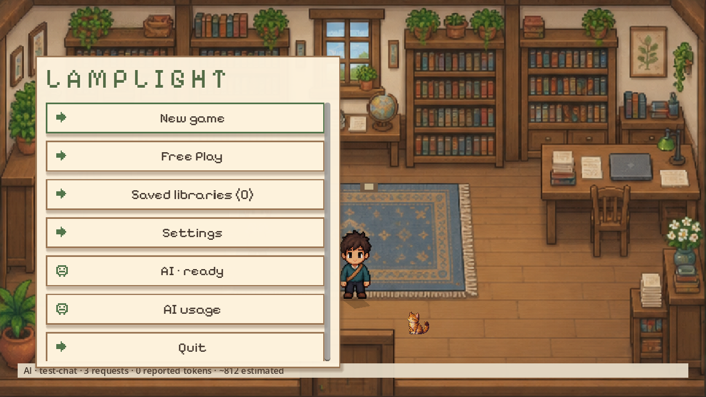
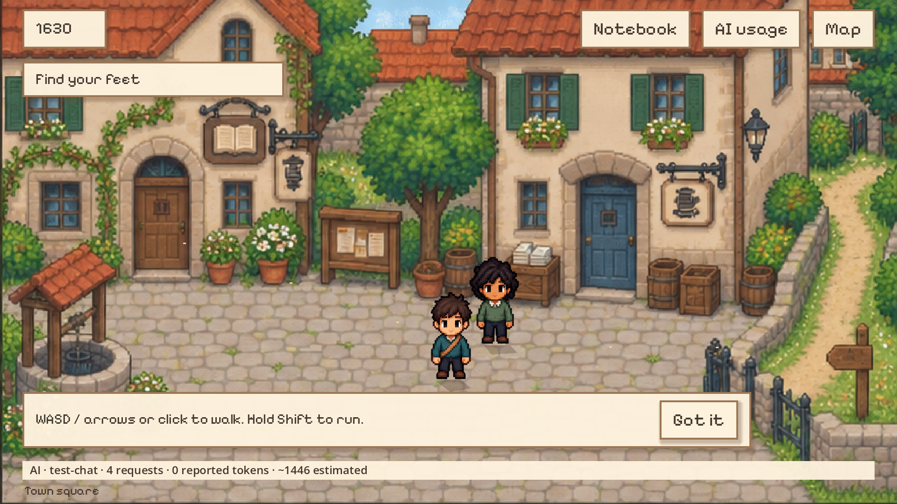
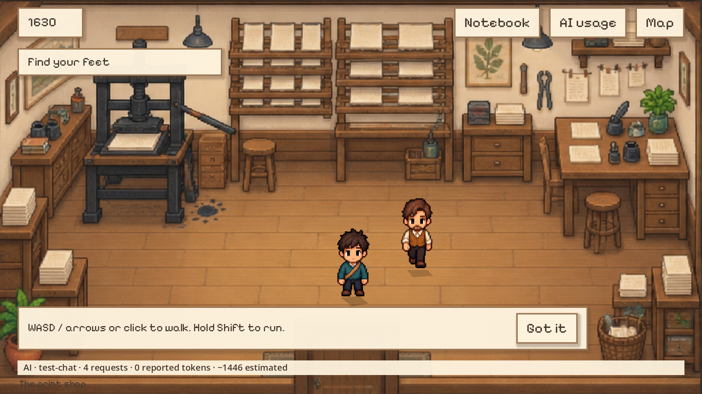
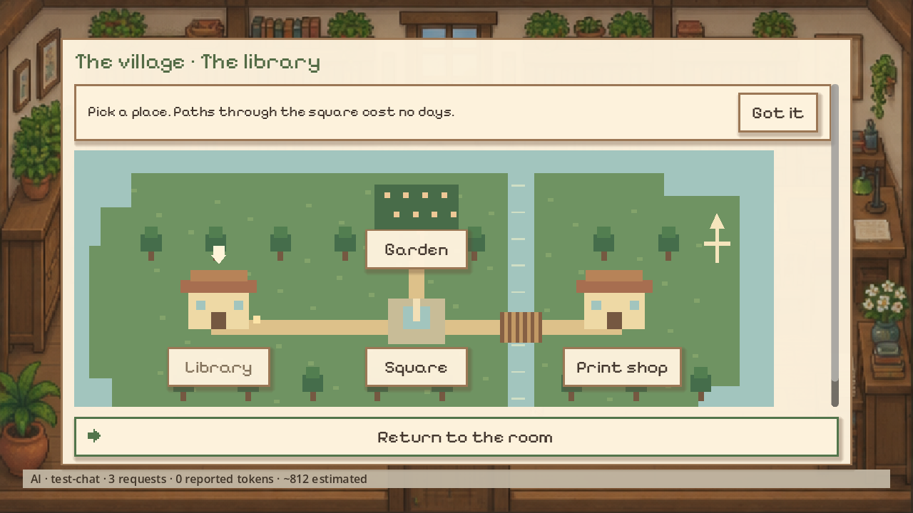
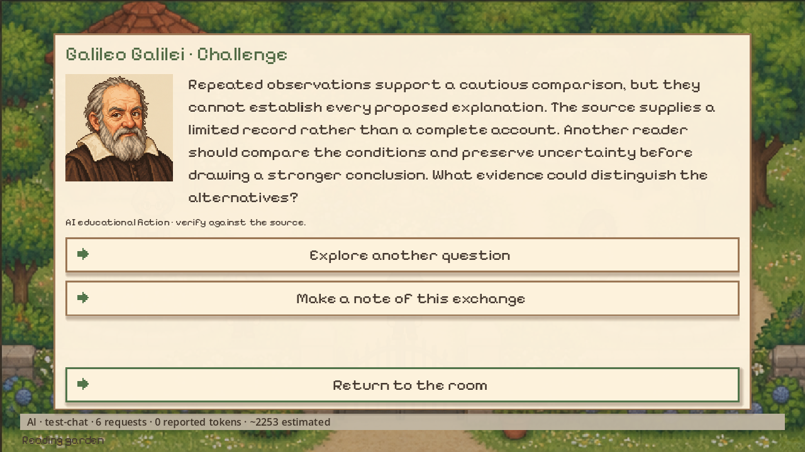
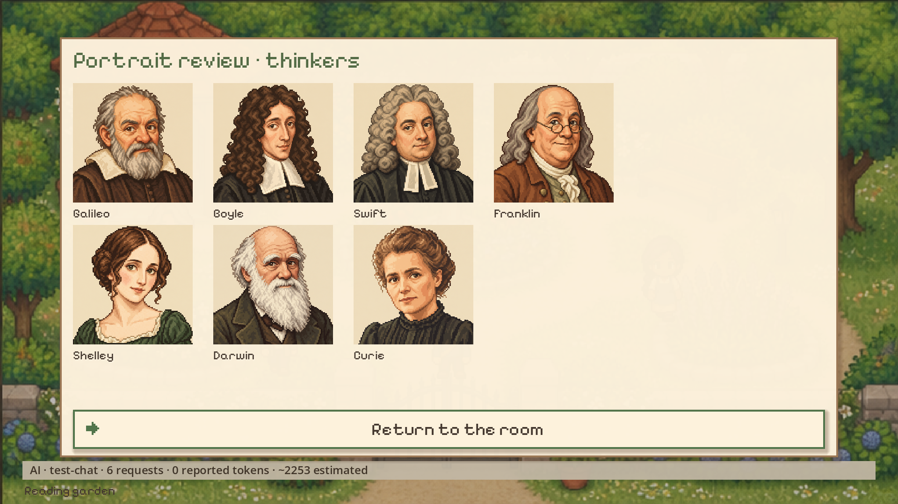

# Lamplight

A writing and research game: a pixel-art library with 1,200 Project Gutenberg books,
a letter-writing campaign running from 1630 to 1930, and a native Godot client. It
used to live inside `article-writer` and was split out on 2026-09-23.

| | |
|---|---|
|  |  |
|  |  |
|  |  |

**Dependency.** Text generation reuses the engine in `../article-writer` (`llm`,
`pipeline`, `research`, `style`): `game_server.py` adds it to `sys.path` and loads
its `.env` (a `.env` in this folder takes precedence). That project is not published
yet, so AI generation needs it checked out next to this one. If the public API of
those modules changes, run this project's tests as well.

```bash
python -B -m unittest test_game_campaign test_game_library test_game_native test_lamplight_ai
```

Saves, downloads and checkpoints go to `output/` (ignored by git).

## Lamplight: an English library and letters through time

```bash
python game_server.py
```

Open `http://127.0.0.1:8765` and choose **English book library**. It includes **1,200
complete English editions**, with at least 150 titles per shelf: science,
philosophy, literature, history, politics and religion. Shelves can overlap.
The catalog is built from [Project Gutenberg's official metadata](https://www.gutenberg.org/ebooks/offline_catalogs.html)
and only accepts editions whose record declares them public domain in the USA. That
declaration does not establish their rights in other countries.

Search by title, author or subject, and take up to 12 books to the computer. The full
text is downloaded when opened and kept in `output/lamplight/books/` for offline
reading. The reader has in-book search, detected chapters, saved position, font,
size and a night theme. Reader pagination does not match the printed edition.
Catalog synopses may be generated by Gutenberg; the writing dossier receives the
full downloaded text.

The computer keeps the seven formats from `pipeline.py`, with automatic, guided or
manual writing. Guided mode stops at the pipeline's decision points. The editor saves
manuscripts locally, supports Markdown and exports `.md`. The five residents offer
feedback using a shared model or one per character. Their prompts receive samples
from the books and up to 60,000 characters of the manuscript; their replies never
replace your text automatically.

In **Settings** you can adjust providers, fallbacks, models and a local monthly call
budget. Custom providers use a chat-completions-compatible API: set their URL, models
and the name of an environment variable holding the key, add that variable to `.env`
and restart the server. Keys are never sent to the browser. Metrics count local
logical calls and estimate tokens; they do not reflect the balance or quota of an
external subscription. Provider retries may add extra usage. One AI task runs at a time.

WASD/arrows to walk, E to interact, or click to move. There are also shortcuts to
every feature. Ambient sound is optional; the coffee maker has a minigame and Miso
the cat has three hidden rewards. All browser pixel art is drawn locally with canvas,
without downloading external visual assets.

The English library is used outside the historical campaign; each collection keeps
its own source cart. Archive editions are not given to a period's residents and do
not count toward historical commissions. Your earlier campaign is preserved.

```bash
python game_catalog.py                    # rebuild the English catalog from the official RDF
python -m unittest test_game_library test_game_campaign -v
python check_game_browser.py              # optional visual check, requires Playwright
```

Integration checks use mocked responses and temporary saves; they do not consume
the configured APIs. Generation checkpoints are kept in `output/lamplight/jobs/`.
If the server restarts during a generation, its state is marked interrupted and the
files remain available for recovery.

### Historical campaign

```bash
python game_server.py --port 8765
```

Open `http://127.0.0.1:8765` and choose **Letters across time** (shortcut **6**).
The campaign has English and Spanish controls. It starts in 1630 and advances in
50-year jumps up to 1930. The computer and its connection to the models are the
fantastical exception; sources and correspondents are restricted on the server.

Study the library notes, bring sources to the desk and write a manuscript. Copyist
shifts pay coins and paper without using an API. Each era demands longer texts, more
sources and, from 1680 on, arguing with a received letter. The markers `[B1]`, `[B2]`,
etc. identify notes; the mail shows its `[L…]` marker. You can insert them from the
campaign and develop the argument in the editor. Delivering a commission pays coins
and prestige. Meet the machine's requirements, collect pending mail and jump to the
next era.

Mail costs postage and paper. Replies take one to four in-game days, allow
rejoinders, and you can only write to correspondents active in that era. They are
**fictional debates with prepared replies**, not authentic letters. **Send with AI
reply** additionally offers a reply to your specific argument using the model
configured for residents. It only receives notes from that era and previously
delivered letters; it keeps the postal delay and charges no postage if it fails. A
filter rejects explicit future years and replies in the wrong language, but it cannot
catch every anachronism. The fictional residents and the desk can also use the
configured providers; their instructions and context are limited to the era, though
that does not guarantee a model never commits an anachronism. The whole campaign
can be played without keys or network.

The first historical catalog contains **14 original bilingual study notes**, two
new ones per era, not fourteen full books. Each links to the reference work or
documentation. External pages are modern references outside the fiction; they are
not downloaded or passed to the characters. For example, the entry for
[Frankenstein (1818)](https://www.gutenberg.org/ebooks/41445) distinguishes that
edition from 1831, and the one for [Relativity](https://www.gutenberg.org/ebooks/5001)
identifies the 1920 translation. The earlier Gutenberg catalog and its downloads are
kept on disk: its editions do not enter the campaign until individually dated.
A US public-domain label does not mean historical availability or universal
permission; [Gutenberg explains its territorial conditions](https://www.gutenberg.org/policy/permission.html).

The economy, deadlines and places are fictional rules. Commission acceptance checks
length, references, resources and duplicate payments: **it does not certify literary
quality, historical accuracy or originality**. Nothing is published outside the game.
Progress is saved atomically to `output/lamplight/campaign.json`, separate from
earlier manuscripts and preferences. Tests use temporary directories and never
modify your save.

```bash
python -m unittest test_game_campaign -v  # full campaign and HTTP limits, no external network
python check_game_browser.py            # interface; requires Playwright and its Chromium
```

## Lamplight in Godot

Game development continues in the native project `godot/project.godot`. From this
folder, run `python run_lamplight.py --editor` to open Godot and press F5 to play.
`python run_lamplight.py` launches the game directly. The launcher runs the local
Python service and keeps saves separate per mode. If the engine is missing, use
`python run_lamplight.py --setup`.

Startup no longer spends calls checking HyperCharm before opening the window:
`--hyper` and `LAMPLIGHT_AUTO_HYPER=1` only load the configuration. The test starts
from **AI setup**, with activity and elapsed time visible. The computer and the desk
offer five saved steps (question, evidence, outline, draft and revision) with AI
feedback and player approval between steps. **AI usage** shows requests, errors,
timings and tokens; it separates provider-reported data from estimates and does not
represent your balance.

The first native build has movement, collisions, dialogue, reading, writing and
separate saves. Earlier browser saves are preserved; their migration is still
pending. See [native progress](docs/M1_NATIVE.md) for what is implemented, the
checks and next steps.

## License

Code, text and generated art are released into the public domain under
[CC0 1.0](LICENSE). Third-party assets keep their own licenses: Pixelify Sans is
under the SIL Open Font License and *Mystical Piano* by Indieteur is CC0; see
[`godot/assets/CREDITS.md`](godot/assets/CREDITS.md).
