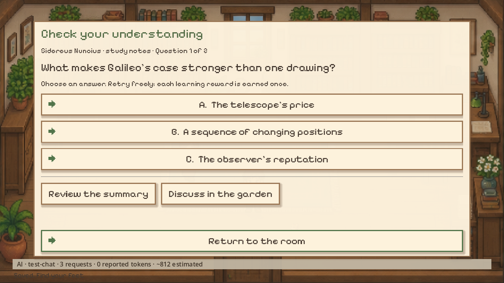
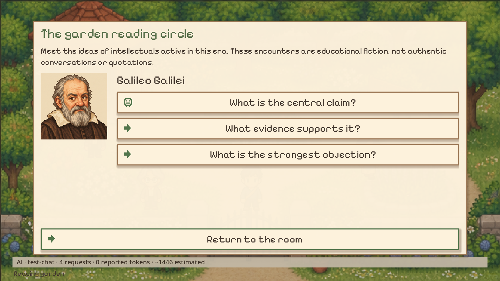
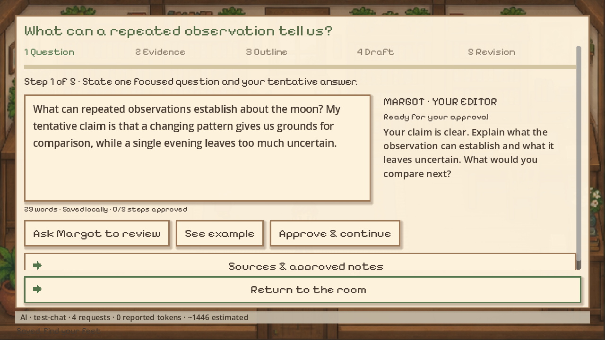

# Lamplight

**A cozy pixel-art game about reading, thinking and writing your way home through
three hundred years of ideas.**

You were cataloguing papers in 2026 when an experimental time recorder failed. You
wake in 1630, beside a village library, with a satchel, a laptop and a broken
recorder. Nobody else came with you. Margot, the librarian, offers you a desk and a
room upstairs. To get home you will read, ask good questions, argue with the great
thinkers of each age and write articles that the village keeps for the generations
that follow you, fifty years at a time, until 1930 and the last jump back to 2026.

| | |
|---|---|
|  |  |
|  |  |
|  |  |
|  |  |

**[Download the latest release](https://github.com/augusto-rehfeldt/lamplight/releases/latest)**
· **[Read the wiki](https://github.com/augusto-rehfeldt/lamplight/wiki)** for the full guide to
eras, characters, mechanics and AI setup.

## What kind of game is this?

Lamplight is a slow, gentle game about learning. There is no combat, no fail state and
no time pressure while you walk, talk or practise. Most of the game is ordinary work:
you read short study notes, answer questions about them, talk the ideas over with the
villagers, and turn what you learned into your own writing.

- **Seven eras, one village.** The campaign runs 1630, 1680, 1730, 1780, 1830, 1880 and
  1930. Each era has its own custodian, a descendant of the one before, and a featured
  work: Galileo's moons, Boyle's furnace, Newton's prism, Franklin's electricity,
  Shelley's *Frankenstein*, Darwin's *Origin* and Einstein's relativity.
- **Learning that you can't skip.** Every study note has two comprehension questions.
  A wrong answer explains the idea at no cost, and you can retry as often as you like.
  You get the reward once, when you actually understand the note.
- **Period thinkers, and only period thinkers.** In the garden reading circle you can
  discuss a work with its author. The author has to be alive and already have
  published it in the year you are in, and you have to have studied the work.
  In 1630 that means Galileo and nobody else.
- **A real writing workshop.** Your laptop and the print shop desk take you through a
  saved five-step process: question, evidence, outline, draft and revision. Margot
  reviews each step, and you decide when to approve it and move on.
- **Letters across time.** Write to correspondents active in your era, wait days of
  game time for the mail, and argue with the reply.
- **Three ways to play.** *The Way Back* is the story campaign. *A Library of Your
  Own* is free reading and writing with no deadlines. *The Contemporary Study* is a
  present-day writing room.

## Quick start

Requires Python 3.11 or newer (developed on 3.14) and, for the main game, Godot 4.7.2 (the launcher can fetch it
for you on Windows).

```bash
git clone https://github.com/augusto-rehfeldt/lamplight.git
cd lamplight
pip install -r requirements.txt

python run_lamplight.py --setup   # Windows: download and verify portable Godot 4.7.2
python run_lamplight.py           # play
```

On macOS or Linux, install Godot 4.7.2 yourself and pass it in with
`python run_lamplight.py --godot /path/to/godot`, or put `godot` or `godot4` on your
`PATH`.

The launcher starts a small local Python service that owns your saves, the campaign
rules and every AI request, then opens the game window. Keep it running while you play.

### Connecting an AI

The native game needs a language model. It plays your villagers and the historical
thinkers, and it reviews your workshop steps. When you start, the **AI setup** screen
lets you pick one of these:

- **Ollama** on your own machine. There is no API fee, but you need a capable
  computer and a downloaded chat model. The default endpoint is
  `http://localhost:11434/v1`.
- **Groq's free tier** or **specific OpenRouter free models**.
- Any other **OpenAI-compatible** chat-completions endpoint that you have a key for.

Press **Connect & benchmark**. Lamplight sends three small test tasks and accepts the
model if it scores at least 80/100, with 75 per task and every critical rule passed.
This check matters because a model that invents quotations or leaks future
knowledge into 1680 would spoil the game. You have to pass it again each time you
start the launcher or change your setup.

Keys typed into the game stay in memory and are never written to a save. You can
also put them in a `.env` file instead (see [`.env.example`](.env.example)).

### Other launch options

```bash
python run_lamplight.py --editor   # open the project in Godot; press F5 to play
python run_lamplight.py --hyper    # preload the AW_* provider from .env
python run_lamplight.py --check    # headless integration test with temporary saves
python run_lamplight.py --capture  # write screenshots to output/lamplight-engine-check/
```

## How to play

| Action | Keys |
|---|---|
| Walk | WASD / arrow keys, or click the floor |
| Run | Hold Shift |
| Interact, talk, use | E, or click the person or object |
| Journal, actions and settings | J or Esc |

The village has four connected places:

- **The library** has Margot, Miso the cat, the study notes, your laptop and the
  time recorder.
- **The town square** is where Noor, the bookbinder, works.
- **The print shop** has Jules, the printer, plus the writing and postal desks.
- **The garden** has Ada and Elias, and the period reading circle.

Your journal always shows the next objective. A short tutorial introduces each
system the first time you meet it, and you can replay it from the notebook.

A typical era goes like this:

1. Meet the custodian and read the era's **featured study note** at the library shelf.
2. Answer both of its **learning questions**.
3. Go out through the square to the print shop and the garden.
4. **Discuss** the work with its author in the garden reading circle.
5. Write a **learning note** of 45 words or more on your laptop that cites the source
   as `[B1]`, `[B2]` and so on.
6. **Publish** a longer sourced article at the print shop. From 1680 on, you also
   need a delivered letter.
7. **Calibrate** the time recorder by answering the era's evidence question, then
   **cross** fifty years ahead.

Crossing also needs the era's coins, paper, prestige and knowledge. You earn these
from commissions, copyist shifts and mastered notes. Everything you write stays in
your library.

Full details are in the **[wiki](https://github.com/augusto-rehfeldt/lamplight/wiki)**.

## The browser edition

Lamplight also ships an earlier canvas-based browser edition with a much larger
reading library:

```bash
python game_server.py      # then open http://127.0.0.1:8765
```

- **English book library.** This has 1,200 complete public-domain books from
  [Project Gutenberg](https://www.gutenberg.org/), with at least 150 on each of six
  shelves: science, philosophy, literature, history, politics and religion. Search,
  take up to 12 books to your desk and read them in a full reader with chapters,
  search, saved position and a night theme. Books are downloaded when you first open
  them and then cached for offline reading.
- **Letters across time.** This is the original English/Spanish campaign, where you
  write commissions and trade letters with prepared (or AI-written) historical replies.
- **A writing computer** with seven formats and automatic, guided or manual writing,
  plus feedback from five resident readers.

The browser edition reads its provider settings from `.env` (`AW_API_KEY`,
`AW_BASE_URL`, `AW_MODEL_PRO`, `AW_MODEL_FLASH`), and you can change them later in its
**Settings** screen. The campaign can be played there without any key or network.

`python game_catalog.py` rebuilds the book catalog from Gutenberg's official RDF
metadata. The catalog only accepts editions that Gutenberg marks as public domain in
the USA, which does not settle their status elsewhere.

## Honest limits

- The historical encounters are **educational fiction**. The study notes are
  original summaries, not quotations or full editions. AI replies are restricted to
  period sources, but no filter catches every anachronism, so check claims against
  the sources.
- The workshop reviews are editorial guidance, not a certification of quality,
  accuracy or originality. Lamplight never publishes anything outside the game.
- The **AI usage** counters are local estimates. They are not your provider balance.
- This is a playable development build. The village is four fixed-camera maps, and
  the thinkers share a single visitor sprite in the world (each has their own
  portrait in dialogue). Older browser saves are not migrated to the native game yet.

## Saves and privacy

Everything stays on your computer, under `output/`:
`output/lamplight-native/` for the Godot game and `output/lamplight/` for the browser
edition. Saves are written atomically and keep a `.bak` copy. Lamplight sends to your
chosen AI provider only what a request needs: the prompt, the relevant source
excerpts and, for workshop reviews, your current step. Keys are never sent to the
game window or stored in saves, and a manuscript is only sent when you ask for feedback on it. The usage log records model names, timings and token counts, and nothing
you wrote.

## Project layout

| Path | What it is |
|---|---|
| `godot/` | The native Godot 4.7.2 client (scenes, scripts, art, audio) |
| `run_lamplight.py` | Launcher: fetches Godot, starts the local service, opens the game |
| `game_native.py` | Local service for the native game: saves, rules, AI gateway |
| `game_campaign.py` | Eras, thinkers, study notes, commissions and economy |
| `lamplight_story.py` | Chapters, objectives and the time recorder trials |
| `lamplight_learning.py` | Learning questions and mastery |
| `lamplight_ai.py`, `lamplight_writing.py` | AI qualification benchmark and workshop steps |
| `game_server.py`, `game/` | Browser edition server and client |
| `engine/` | Bundled writing engine: provider routing, drafting pipeline, research, style |
| `docs/` | Design notes, benchmark results and screenshots |

## Development

```bash
python -B -m unittest test_game_campaign test_game_library test_game_native test_lamplight_ai
python run_lamplight.py --check      # headless Godot against the real service
python check_game_browser.py         # browser edition; needs Playwright + Chromium
python bench_lamplight.py --models MODEL_A MODEL_B --repeat 2   # live model comparison
```

Game rules live on the Python side, and the Godot client never decides rewards,
mastery or eligibility. The tests use temporary saves and mocked AI, so they never
touch your saves or call paid providers. `bench_lamplight.py` is the only command
that makes live AI calls, and it only runs when you start it.

Design notes: [cozy learning build](docs/COZY_LEARNING.md) ·
[native foundation](docs/M1_NATIVE.md) · [campaign editions](docs/CAMPAIGN_EDITIONS.md) ·
[AI benchmark](docs/AI_BENCHMARK.md) · [production plan](PLAN.md).

## License

Code, text and generated art are dedicated to the public domain under
[CC0 1.0](LICENSE). Third-party assets keep their own licenses: the Pixelify Sans font
is under the SIL Open Font License, and *Mystical Piano* by Indieteur is CC0. See
[`godot/assets/CREDITS.md`](godot/assets/CREDITS.md).
